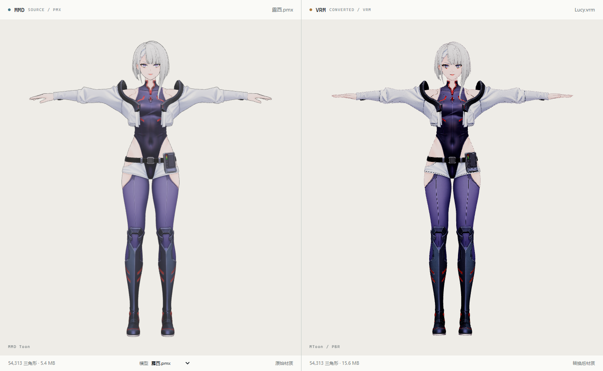
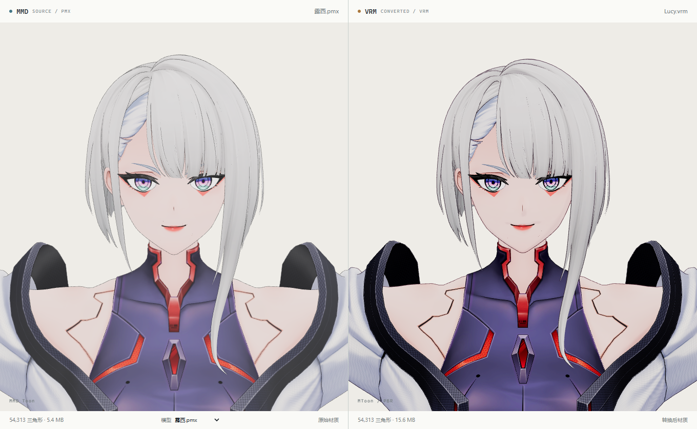

# MMD 转 VRM Skill

[English](README.md) · [Skill 入口](SKILL.md) · [已验证经验库](references/lessons.json)

**[打开在线对比渲染室](https://lucianchen.github.io/mmd-to-vrm-skill/?lang=zh)** · 中文 / English · 模型在本机处理。

将已有骨骼的 MMD 角色转换为 **VRM 1.0**，交付可编辑工程、优化后的模型和可复核的验证记录。每次先审计实际模型，再配置骨骼、表情、材质与物理；仅凭骨骼名称不能保证动作正常。

仓库包含可参数化的 PMX 转换器、保留作者修改的 Blender 工程处理流程、VRM 优化器、本地对比渲染网页，以及持续积累经验的维护机制。源模型、贴图和本机专用配置保留在任务目录中；下方展示图是 Owner 明确要求加入 README 的对比渲染。

## MMD / VRM 转换对比

**左侧是实际源 PMX，右侧是最终 VRM**。两侧使用同一个浏览器、相同灯光与相机设置，按身高归一化并尽可能对齐 T 姿态，暂停物理。保留材质转换带来的可见差异，没有通过后期修图消除差别。

**全身对比**



**面部与材质细节**



模型：露西 / Lucy。模型提供：**鸣潮 / Wuthering Waves**；模型改造：**homura59**。图片来自真实模型渲染；MMD 侧采用 Three.js MMD Toon，不能等同于原生 MMD + MME，VRM 侧采用 three-vrm MToon/PBR。[渲染条件与署名](assets/comparison/README.md)。

## 对比渲染网页：在线或本地

可以直接打开[免费在线版](https://lucianchen.github.io/mmd-to-vrm-skill/?lang=zh)，无需安装；也可以先运行 `npm ci --ignore-scripts`，再本地启动：

```sh
npm run compare
```

打开 **http://127.0.0.1:8766**，选择含贴图的完整 MMD 文件夹，再选择贴图内嵌的 VRM 文件。如果文件夹包含多个 PMX，可在左侧视窗下方切换版本。文件在本机处理。

右上角 **中文 / EN** 可切换操作文案、加载状态、错误提示、几何统计和导出图片说明，切换不会重载模型或移动相机。网页记住语言选择；`?lang=en` / `?lang=zh` 可指定链接语言。首次访问时，中文浏览器使用中文，其余语言默认英文。

支持同步旋转、缩放和平移，也能关闭同步独立观察；提供全身、面部、背面视角，共同亮度控制、自动旋转和 PNG 对比图导出。窄屏下两个视窗上下排列。也可通过启动参数直接载入本地示例：

```sh
npm run compare -- --mmd /assets/avatar/model.pmx --vrm /work/avatar/Avatar.vrm
```

服务只监听本机回环地址，仅提供选中的模型资源，不会上传或对外发布模型。端口被占用时加 `--port 8767`，按 Ctrl+C 停止服务。这是外观对比工具，不包含一键转换或原生 MMD 物理模拟。[网页使用与限制](references/comparison-viewer.md)。

## 安装与使用

将公开仓库克隆到 Codex 技能目录中的 `mmd-to-vrm`。Windows 默认目录示例：

```powershell
git clone https://github.com/lucianchen/mmd-to-vrm-skill.git "$env:USERPROFILE/.codex/skills/mmd-to-vrm"
Set-Location "$env:USERPROFILE/.codex/skills/mmd-to-vrm"
npm ci --ignore-scripts
npx playwright install chromium
npm test
```

目录已经存在时，先核对 Git 状态和远端，保留未提交修改。保留 Git 工作副本，便于后续将验证过的改进同步到仓库。

在 Codex 中使用 `$mmd-to-vrm` 并提供模型路径，例如：

> 用 $mmd-to-vrm 把这个 PMX 转成 VRM，检查口型、眨眼、手脚蒙皮和物理，并把本次验证过的新经验迭代到 skill。

带骨骼 FBX 包可走[专门适配流程](references/fbx-workflow.md)，处理实际世界坐标、随包材质元数据、多网格和次级物理缺失。已用独立适配器验证三个本地包；现有 PMX 转换器不直接接受 FBX。

## 环境与适用范围

| 组件 | 实测版本 |
| --- | --- |
| Blender | 5.2.1 LTS，Windows Store 启动器 |
| MMD Tools | 4.5.14 |
| VRM Add-on for Blender | 4.7.1 |
| Node.js | 24.12.0；package 声明支持 Node 22+ |
| three / three-vrm | 0.169.0 / 3.4.4 |
| Playwright / esbuild | 1.57.0 / 0.25.12 |

以上为本次 Windows 实测组合，其他平台尚未验证。Blender 插件需单独准备，仓库不内置插件，也不修改全局 Blender 设置。转换 Python 脚本在 Blender 内执行。

- **PMX 自动辅助脚本**：支持单骨架、单蒙皮网格，以及顶点形态和递归组合形态。遇到不支持的结构明确停止，先审计再局部适配。
- **已有 Blender 工程**：根据[工程保留流程](references/blend-workflow.md)处理，保留作者调整的服装、PBR 材质和内嵌贴图。PMX 脚本不能直接覆盖所有 Blender 工程。
- **映射配置**：依据实际顶点权重、辅助骨约束、形态类型和许可，为每个模型填写独立配置。
- **转换边界**：MMD 刚体行为和部分 sphere 材质需要近似；保留原工程用于进一步调整。导出为兼容常见查看器使用每个顶点权重最大的四个关节影响。

完整配置与命令见[运行说明](references/operation.md)，表情与物理细节见[专项说明](references/expressions-physics.md)。

## 工作流程与交付物

1. 审计源 PMX / Blender 工程，记录哈希、作者和使用条款。
2. 根据真实骨骼、权重、材质和形态填写仓库外的 JSON 配置。
3. 导出内嵌贴图的可编辑 `.blend` 和 `Avatar-export-original.vrm`。
4. 优化为独立的 `Avatar.vrm`，逐项核对保留的访问器数值和贴图字节。
5. 使用 Chromium 和 three-vrm 实际加载最终文件，检查 13 个标准表情、手臂/腿部动作和 600 帧物理，再人工查看截图。
6. 生成最终审计报告，用 SHA-256 确认优化和运行报告对应交付的这个文件。

日常使用 **`Avatar.vrm`**。较大的 **`Avatar-export-original.vrm`** 是优化前的对照与回退备份，不是运行模型时还要加载的一份文件。最终效果确认后，可在保留可编辑工程和最终文件的前提下删除；再次优化要从原始导出开始，不能重复处理已经拆分过的优化版本。

优化器只接受文档中明确支持的单网格、内嵌贴图 VRM 结构。数值和贴图一致性验证覆盖这一步优化，不能证明全部 MMD 功能都等价转换。浏览器运行验证也不代表已完成目标应用接入或手机性能验收。详见[验证边界](references/validation.md)。

## 每次转换后自我迭代

转换完成后，助手对照[经验库](references/lessons.json)检查新问题。新证据可以用于修正文档、改进通用脚本、补充针对性回归测试，并记录适用范围明确的经验。同一经验重复记录不会产生修改；修正已有经验必须明确使用替换操作。

```sh
node scripts/record_lesson.mjs --entry /work/verified-lesson.json
npm test
```

每条经验包含 `id`、`status: "verified"`、`date`、`scope`、`observation`、`resolution`、`evidence`、`regression`、`limitations`。记录器检查结构和常见本机路径，但证据真实性及完整 diff 仍由助手复核；格式通过不代表结论已经成立。

Owner 已要求持续维护本公开仓库。相关验证通过后，助手只提交可复用改动，向已核对的 origin 推送，并比较本地和远端提交哈希。此流程在每次转换任务中执行，没有后台定时器。没有新经验就不强行改动。完整要求见[迭代协议](references/iteration.md)。

## 免费托管与自动发布

在线版使用 **GitHub Pages**。每次推送到 `main`，[Pages 工作流](.github/workflows/pages.yml)会运行测试、构建并部署。工作流只在公开仓库运行，采用标准 `ubuntu-latest` runner。GitHub 官方提供[公开仓库的免费 Pages](https://docs.github.com/en/pages/getting-started-with-github-pages/what-is-github-pages)，以及[公开仓库的免费标准 Actions runner](https://docs.github.com/en/billing/concepts/product-billing/github-actions)。

`npm run build:compare` 生成 `dist/`，只包含 HTML、CSS、带依赖版权说明的 JavaScript 和空示例配置。无需后端或上传接口；在线版通过浏览器 File API 读取你选择的模型。模型文件、贴图、本地示例配置和 README 渲染图均不进入网站发布包。该目录也可用于其他静态托管。[构建与部署细节](references/comparison-viewer.md#static-hosting)。

## 已有验证与目录

首次参数化 PMX 流水线已在一个本地模型上完成全流程：**54,313 个三角形、176 个自定义形态、53 个人形骨骼、141 个弹簧关节**。原始导出 **35,655,224 字节**，优化后 **15,629,324 字节**；浏览器检查没有报告 JavaScript 错误或非有限几何数据。源模型和生成模型文件不包含在仓库中。

19 项 Node 自动测试覆盖材质拆分、稀疏形态与正负零、表情/第一人称重映射、节点形态权重、贴图字节保持、不支持输入的拒绝、物理过程中的瞬时错误、着色器错误、经验记录和修订、对比网页的资源路径解析、翻译完整性及静态发布范围。模型测试只使用程序生成的几何体。每个真实模型仍须单独验证和看图。

另有 5 项无第三方依赖的 Python 测试，覆盖 SDEF 存储形态分类和歧义形态的拒绝处理。运行 `python -m unittest discover -s tests -p 'test_*.py'`，CI 同时执行 Python 与 Node 测试。SDEF 辅助数据不作为表情导出，原始 Blender 导入工程仍保留完整数据。

| 路径 | 用途 |
| --- | --- |
| `SKILL.md`、`agents/openai.yaml` | Codex 技能入口与发现信息 |
| `scripts/inspect_model.py`、`scripts/convert_pmx.py` | Blender 审计与配置驱动的 PMX 转换 |
| `scripts/optimize_vrm.mjs` | 保留数值和贴图的稀疏形态优化 |
| `scripts/viewer.js`、`scripts/verify_vrm.mjs` | 本地渲染、动作、表情与物理验证 |
| `scripts/audit_vrm.mjs` | 与交付文件哈希绑定的最终审计 |
| `scripts/record_lesson.mjs` | 有证据的经验记录、去重与明确替换 |
| `compare/`、`scripts/serve_compare.mjs` | 本地交互式 MMD / VRM 对比网页 |
| `assets/comparison/` | 本次要求的 README 展示图与署名 |
| `references/`、`tests/` | 详细流程、经验库和合成回归测试 |

转换许可与模型分发许可需要分别核对。每次读取来源条款，保留署名和限制；维护 skill 时不要上传源模型、转换后模型文件或贴图。只有明确要求发布对比截图时，才将有署名的展示图加入相应提交。
